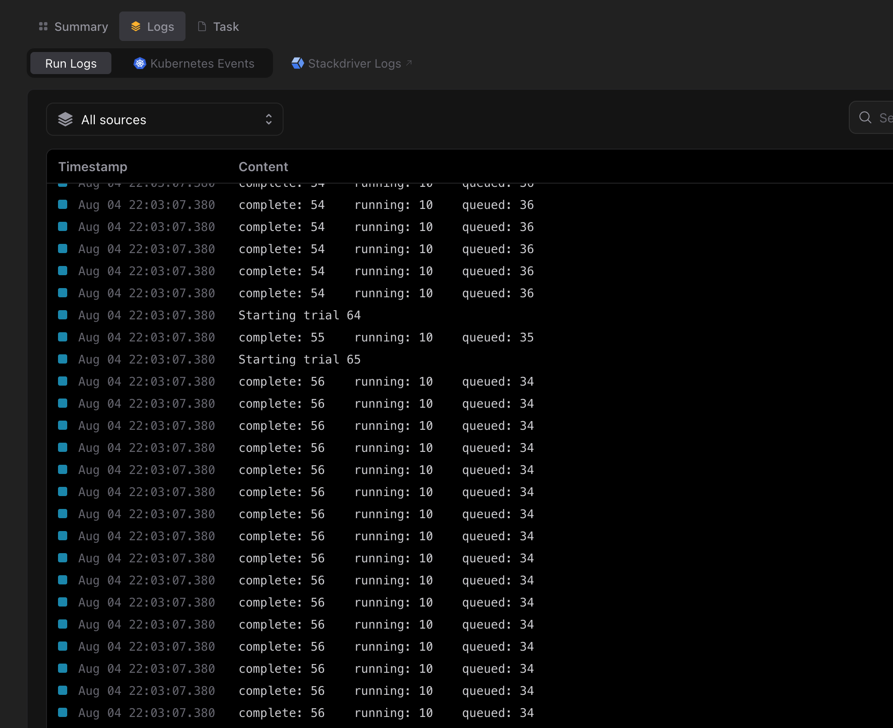
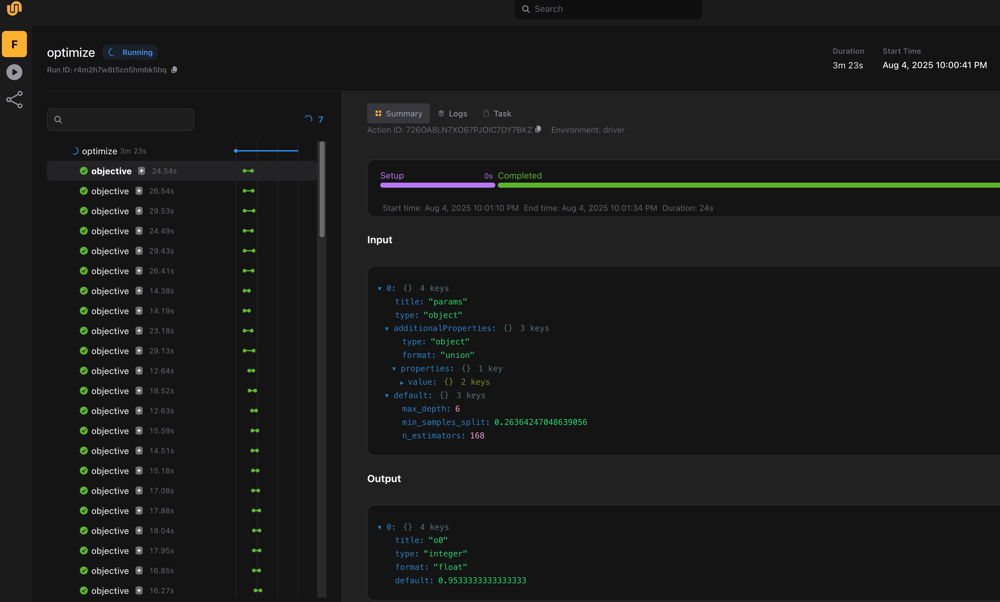

# Hyperparameter optimization

> [!NOTE]
> Code available [here](https://github.com/unionai/unionai-examples/tree/main/tutorials-v2/ml/optimizer.py).

Hyperparameter Optimization (HPO) is a critical step in the machine learning (ML) lifecycle. Hyperparameters are the knobs and dials of a model—values such as learning rates, tree depths, or dropout rates that significantly impact performance but cannot be learned during training. Instead, we must select them manually or optimize them through guided search.

Model developers often enjoy the flexibility of choosing from a wide variety of model types, whether gradient boosted machines (GBMs), generalized linear models (GLMs), deep learning architectures, or dozens of others. A common challenge across all these options is the need to systematically explore model performance across hyperparameter configurations tailored to the specific dataset and task.

Thankfully, this exploration can be automated. Frameworks like [Optuna](https://optuna.org/), [Hyperopt](https://hyperopt.github.io/hyperopt/), and [Ray Tune](https://docs.ray.io/en/latest/tune/index.html) use advanced sampling algorithms to efficiently search the hyperparameter space and identify optimal configurations. HPO may be executed in two distinct ways:

- **Serial HPO** runs one trial at a time, which is easy to set up but can be painfully slow.
- **Parallel HPO** distributes trials across multiple processes. It typically follows a pattern with two parameters: **_N_**, the total number of trials to run, and **_C_**, the maximum number of trials that can run concurrently. Trials are executed asynchronously, and new ones are scheduled based on the results and status of completed or in-progress ones.

However, parallel HPO introduces a new complexity: the need for a centralized state that tracks:

- All past trials (successes and failures)
- All ongoing trials

This state is essential so that the optimization algorithm can make informed decisions about which hyperparameters to try next.

## A better way to run HPO

This is where Flyte shines.

- There's no need to manage a separate centralized database for state tracking, as every objective run is **cached**, **recorded**, and **recoverable** via Flyte's execution engine.
- The entire HPO process is observable in the UI with full lineage and metadata for each trial.
- Each objective is seeded for reproducibility, enabling deterministic trial results.
- If the main optimization task crashes or is terminated, **Flyte can resume from the last successful or failed trial, making the experiment highly fault-tolerant**.
- Trial functions can be strongly typed, enabling rich, flexible hyperparameter spaces while maintaining strict type safety across trials.

In this example, we combine Flyte with Optuna to optimize a `RandomForestClassifier` on the Iris dataset. Each trial runs in an isolated task, and the optimization process is orchestrated asynchronously, with Flyte handling the underlying scheduling, retries, and caching.

## Declare dependencies

We start by declaring a Python environment using Python 3.13 and specifying our runtime dependencies.

```
# /// script
requires-python = "==3.13"
dependencies = [
   "optuna>=4.0.0,<5.0.0",
   "flyte>=2.0.0b0",
   "scikit-learn==1.7.0",
]
# ///
```

With the environment defined, we begin by importing standard library and third-party modules necessary for both the ML task and distributed execution.



These standard library imports are essential for asynchronous execution (`asyncio`), type annotations (`typing`, `Optional`, `Union`), and aggregating trial state counts (`Counter`).



We use Optuna for hyperparameter optimization and several utilities from scikit-learn to prepare data (`load_iris`), define the model (`RandomForestClassifier`), evaluate it (`cross_val_score`), and shuffle the dataset for randomness (`shuffle`).



Flyte is our orchestration framework. We use it to define tasks, manage resources, and recover from execution errors.

## Define the task environment

We define a Flyte task environment called `driver`, which encapsulates metadata, compute resources, the container image context needed for remote execution, and caching behavior.



This environment specifies that the tasks will run with 1 CPU and 250Mi of memory, the image is built using the current script (`__file__`), and caching is enabled.



> [!NOTE]
> You can configure the Flyte task environment to reuse containers across multiple executions by setting the `reusable` field to `flyte.ReusePolicy(replicas=..., idle_ttl=...)`.
> This is especially useful when the final objective computations are short-lived, as it avoids unnecessary container spin-up costs.
> Learn more about reusable containers [here](https://www.union.ai/docs/v2/byoc/user-guide/reusable-containers/).



## Define the optimizer

Next, we define an `Optimizer` class that handles parallel execution of Optuna trials using async coroutines. This class abstracts the full optimization loop and supports concurrent trial execution with live logging.



We pass the `objective` function, number of trials to run (`n_trials`), and maximum parallel trials (`concurrency`). The optional delay throttles execution between trials, while `log_delay` controls how often logging runs. If no existing Optuna Study is provided, a new one is created automatically.



This method periodically prints the number of trials in each state (e.g., running, complete, fail). It keeps users informed of ongoing optimization progress and is invoked as a background task when logging is enabled.


_Logs are streamed live as the execution progresses._



Each call to `spawn` runs a single Optuna trial. The `semaphore` ensures that only a fixed number of concurrent trials are active at once, respecting the `concurrency` parameter. We first ask Optuna for a new trial and generate a parameter dictionary by querying the trial object for suggested hyperparameters. The trial is then evaluated by the objective function. If successful, we mark it as `COMPLETE`. If the trial fails due to a `RuntimeUserError` from Flyte, we log and record the failure in the Optuna study.



The `__call__` method defines the overall async optimization routine. It creates the semaphore, spawns `n_trials` coroutines, and optionally starts the background logging task. All trials are awaited with `asyncio.gather`.



This method simply allows us to query the number of trials already associated with the study.

## Define the objective function

The objective task defines how we evaluate a particular set of hyperparameters. It's an async task, allowing for caching, tracking, and recoverability across executions.



We use the Iris dataset as a toy classification problem. The input params dictionary contains the trial's hyperparameters, which we unpack into a `RandomForestClassifier`. We shuffle the dataset for randomness, and compute a 3-fold cross-validation accuracy.

## Define the main optimization loop

The optimize task is the main driver of our optimization experiment. It creates the `Optimizer` instance and invokes it.



We configure a `TPESampler` for Optuna and `seed` it for determinism. After running all trials, we extract the best-performing trial and print its parameters and score. Returning the best params allows downstream tasks or clients to use the tuned model.

## Run the experiment

Finally, we include an executable entry point to run this optimization using `flyte.run`.



We load Flyte config from `config.yaml`, launch the optimize task with 100 trials and concurrency of 10, and print a link to view the execution in the Flyte UI.


_Each objective run is cached, recorded, and recoverable. With concurrency set to 10, only 10 trials execute in parallel at any given time._
