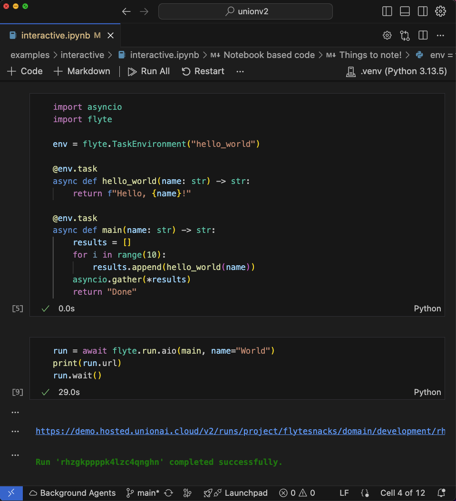
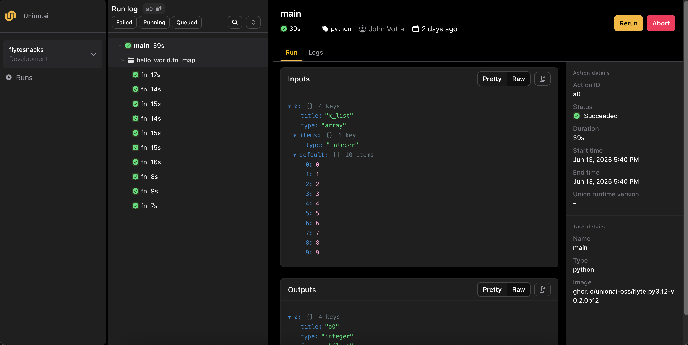

# Flyte 2




Flyte 2 represents a fundamental shift in how workflows are written and executed in Flyte.






Flyte 2 and Union 2 represent a fundamental shift in how workflows are written and executed in Union.





Ready to get started? Go the [Getting started](../getting-started.md) guide to install Flyte 2 and run your first task.


## Pure Python execution

Write workflows in pure Python, enabling a more natural development experience and removing the constraints of a
domain-specific language (DSL).




```python
import flyte

env = flyte.TaskEnvironment("hello_world")

@env.task
def hello_world(name: str) -> str:
    return f"Hello, {name}!"

@env.task
def main(name: str) -> str:
    for i in range(10):
        hello_world(name)
    return "Done"

if __name__ == "__main__":
    flyte.init()
    flyte.run(main, name="World")
```





```python
import flyte

env = flyte.TaskEnvironment("hello_world")

@env.task
async def hello_world(name: str) -> str:
    return f"Hello, {name}!"

@env.task
async def main(name: str) -> str:
    results = []
    for i in range(10):
        results.append(hello_world(name))
    await asyncio.gather(*results)
    return "Done"

if __name__ == "__main__":
    flyte.init()
    flyte.run(main, name="World")
```




As you can see in the hello world example, workflows can be constructed at runtime, allowing for more flexible and
adaptive behavior. The Flyte 2 also supports:
* Python's asynchronous programming model to express parallelism.
* Python's native error handling with `try-except` to overridden configurations, like resource requests.
* Predefined static workflows when compile-time safety is critical.

## Simplified API

The new API is more intuitive, with fewer abstractions to learn and a focus on simplicity.

| Use case | Flyte 1 | Flyte 2 |
|---|---|---|
| Environment management | `N/A` | `TaskEnvironment` |
| Perform basic computation | `@task` | `@env.task` |
| Combine tasks into a workflow | `@workflow` | `@env.task` |
| Create dynamic workflows | `@dynamic` | `@env.task` |
| Fanout parallelism | `flytekit.map` | Python `for` loop with `asyncio.gather` |
| Conditional execution | `flytekit.conditional` | Python `if-elif-else` |
| Catching workflow failures | `@workflow(on_failure=...)` | Python `try-except` |
| Schedule workflows | `LaunchPlan` | `@env.task(on_schedule=...)` |

There is no `@workflow` decorator. Instead, "workflows" are authored through a pattern of tasks calling tasks.
Tasks are defined within environments, which encapsulate the context and resources needed for execution.

## Fine-grained reproducibility and recoverability

Flyte tasks support caching via `@env.task(cache=...)`, but tracing with `@flyte.trace` augments task level-caching
even further enabling reproducibility and recovery at the sub-task function level.

```python
@flyte.trace
async def call_llm(prompt: str) -> str:
    return ...

@env.task
def finalize_output(output: str) -> str:
    return ...

@env.task(cache=flyte.Cache(behavior="auto"))
async def main(prompt: str) -> str:
    output = await call_llm(prompt)
    output = await finalize_output(output)
    return output
```

Here the `call_llm` function is called in the same container as `main` that serves as an automated checkpoint with full
observability in the UI. If the task run fails, the workflow is able to recover and replay from where it left off.

## Improved remote functionality

Flyte 2 provides full management of the workflow lifecycle through a standardized API through the CLI and the Python SDK.

| Use case | CLI | Python SDK |
| --- | --- | --- |
| Run a task | `flyte run ...` | `flyte.run(...)` |
| Deploy a task | `flyte deploy ...` | `flyte.deploy(...)` |

You can also fetch and run remote (previously deployed) tasks within the course of a running workflow.

```python
import flyte.remote

env = flyte.TaskEnvironment(name="root")

# get remote tasks that were previously deployed
torch_task = flyte.remote.Task.get("torch_env.torch_task", auto_version="latest")
spark_task = flyte.remote.Task.get("spark_env.spark_task", auto_version="latest")

@env.task
def main() -> flyte.File:
    dataset = await spark_task(value)
    model = await torch_task(dataset)
    return model
```

## Native Notebook support

Author and run workflows and fetch workflow metadata (I/O and logs) directly from Jupyter notebooks.



## High performance engine

Schedule tasks in milliseconds with reusable containers, which massively increases the throughput of containerized tasks.

```python
env = flyte.TaskEnvironment(
    name="reusable",
    resources=flyte.Resources(memory="500Mi", cpu=1),
    reusable=flyte.ReusePolicy(
        replicas=4,  # Min of 2 replacas are needed to ensure no-starvation of tasks.
        idle_ttl=300,
    ),
    image=flyte.Image.from_debian_base().with_pip_packages("unionai-reuse==0.1.3"),
)
```

Coupled with multi-cluster, multi-cloud, and multi-region support, Flyte 2 can scale to handle even the most demanding
workflows.

## Enhanced UI

New UI with a streamlined and user-friendly experience for authoring and managing workflows.



This UI improves the visualization of workflow execution and monitoring, simplifying access to logs, metadata, and other
important information.
