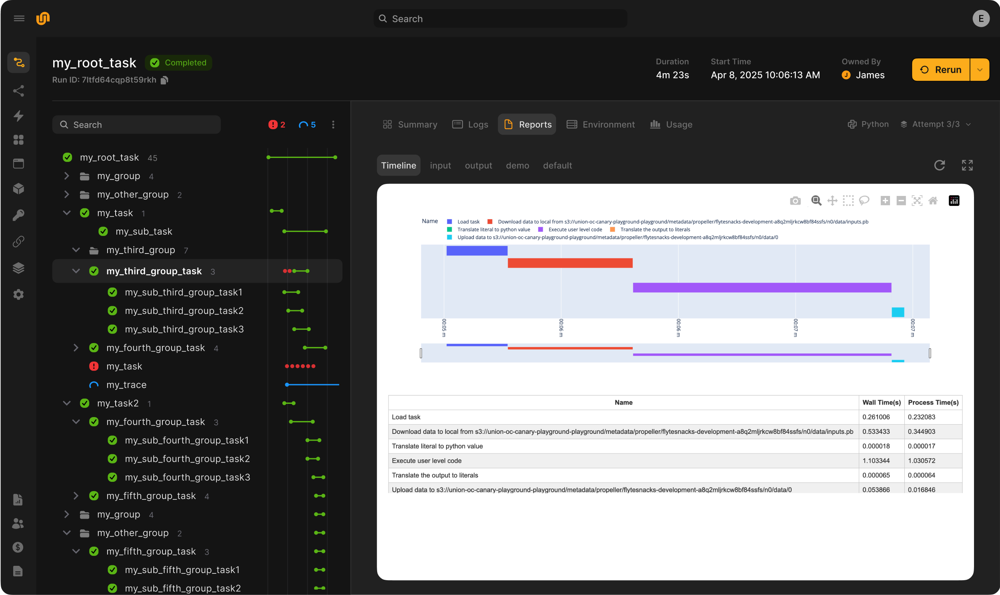

# Reports

The reports feature allows you to display and update custom output in the UI during task execution.

First, you set the `report=True` flag in the task decorator. This enables the reporting feature for that task.
Within a task with reporting enabled, a [`flyte.report.Report`](../api-reference/flyte-sdk/packages/flyte.report#flytereportreport) object is created automatically.

A `Report` object contains one or more tabs, each of which contains HTML.
You can write HTML to an existing tab and create new tabs to organize your content.
Initially, the `Report` object has one tab (the default tab) with no content.

To write content:

* [`flyte.report.log()`](../api-reference/flyte-sdk/packages/flyte.report#log) appends HTML content directly to the default tab.
* [`flyte.report.replace()`](../api-reference/flyte-sdk/packages/flyte.report#replace) replaces the content of the default tab with new HTML.

To get or create a new tab:

* [`flyte.report.get_tab()`](../api-reference/flyte-sdk/packages/flyte.report#get_tab) allows you to specify a unique name for the tab, and it will return the existing tab if it already exists or create a new one if it doesn't.
  It returns a `flyte.report._report.Tab`

You can `log()` or `replace()` HTML on the `Tab` object just as you can directly on the `Report` object.

Finally, you send the report to the Flyte server and make it visible in the UI:

* [`flyte.report.flush()`](../api-reference/flyte-sdk/packages/flyte.report#flush) dispatches the report.

Here is an example of how to use the reporting feature in a task:

```python
import flyte
import flyte.report

env = flyte.TaskEnvironment("name")


@env.task(report=True)
async def task1():
    await flyte.report.replace.aio("<p>The quick, brown fox jumps over a lazy dog.</p>")
    tab2 = flyte.report.get_tab("Tab 2")
    tab2.log.aio("<p>The quick, brown dog jumps over a lazy fox.</p>")
    await flyte.report.flush.aio()


if __name__ == "__main__":
    flyte.init_from_config("config.yaml")
    r = flyte.run(task1)
    print(r.name)
    print(r.url)
```

Here we define a task `task1` that logs some HTML content to the default tab and creates a new tab named "Tab 2" where it logs additional HTML content.
The `flush` method is called to sent the report to the backend.

When the task is run, the report will be visible in the Flyte UI under the task execution details:


